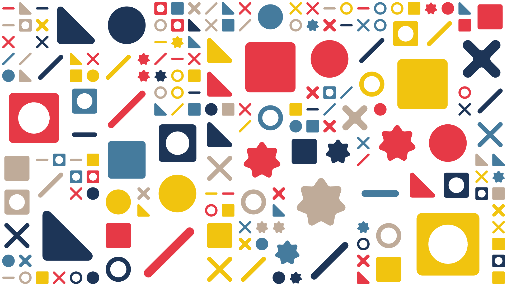

# SVG Grid Drawing Tool



A browser-based generative tool for filling an infinite grid with SVG shapes:
draw/erase brushes, palette recoloring, per-cell backgrounds, a fractal noise
mask, seamless tiling, square-packing divider, multi-cell scaling, time-driven
animation, and SVG / PNG / MP4 export — all on an infinite, zoomable canvas.

## Stack

- **Vite + TypeScript** — dev server, bundling, strict types.
- **Native SVG DOM** as the single source of truth (so SVG export is lossless),
  with `<symbol>` + `<use>` instancing for low DOM weight.
- Seedable noise, palette color math, and a hand-rolled floating UI shell are all
  in-house. The only runtime deps are for animated export: **JSZip** (PNG
  sequence) and **mp4-muxer** + WebCodecs (MP4).

## Run

```bash
npm install
npm run dev        # http://localhost:5173
npm run build      # tsc + vite build -> dist/
npm run typecheck
```

## Architecture

Unidirectional **Store → Render → Input → Commands** loop:

- `src/store/` — observable single source of truth (serializable `SceneState`).
- `src/scene/` — domain model + pure math (`grid`, `camera`, `types`).
- `src/render/` — diffs scene → SVG; virtualizes to the visible cell range.
- `src/tools/` — pointer/wheel input → draw / erase / pan / zoom / block / path.
- `src/commands/` — Command pattern → undo/redo; strokes coalesce to one step.
- `src/features/` — `library`, `palette`, `placement`, `noise`, `divider`.
- `src/anim/` — time-driven animation engine + reveal order.
- `src/export/` — frame, SVG/PNG raster, and animated PNG-zip / MP4 muxers.
- `src/ui/` — the floating shell: modes bar, per-mode toolbox, context panels,
  and the animated menu morph (`morph.ts`).

The camera is the root `<svg>` viewBox; zoom is cursor-anchored. Randomness is
seeded per cell (`hash2(col,row,seed)`) so a scene reproduces deterministically —
the foundation for frame-accurate export.

The UI is organized into four **modes** (Draw, Compose, Animate, Export). Each
mode swaps the bottom toolbox; tools open **context panels** above it (Shapes,
Colors, Stencil, Seamless, Divider, Edit, Grid, …), animated with a fade-out →
size-morph → fade-in transition. A shared Brush/Size/Cell footer sits inside the
brush-relevant panels.

## Features

**Canvas & navigation**
- Infinite canvas: pan (Space / middle-drag / Pan tool), cursor-anchored zoom (wheel / buttons)
- Adjustable cell size (16/32/64/128); virtual rendering with sub-pixel culling
- Dot grid with optional rounded cells + gutter; per-cell background fill (fixed or random)
- Undo / redo / clear; strokes coalesce to one undo step; shortcuts (B, E, P, ⌘Z, ⌘⇧Z)

**Draw mode**
- Draw + Erase brushes — size 1–4, square/circle/cross footprint, multi-cell **Size** (one SVG over N×N)
- Optional random 90° rotation per placed SVG
- **Block** tool — mark no-go cells (drag rectangle or paint); draw + stencil skip them
- **Stencil** — paint inside a mask "opening" (a green rounded/dotted silhouette). Pluggable
  sources: **Noise** (fBm), **Stripes** (diagonal zebra), **Image** (upload read as B/W,
  threshold/invert), **Text** (rasterized glyphs). The brush only paints inside the opening;
  "Apply to view" stencils it. Plus **Lock projection** (stays put on screen while you pan)
  and **Add mode** (additive instead of replace)
- **Shapes** library: starter set + per-asset multi-select (or Random), Select all, and SVG upload
  (drag-drop / file picker) — sanitized, normalized to `currentColor`, persisted in IndexedDB
- **Colors**: palette picker + swatch editor (add/edit/remove), canvas background, per-cell random fill

**Compose mode**
- **Seamless** — tileable noise + a live tile frame (drag/resize, snap to cell) with neighbor ghosts and
  seam highlighting; "Apply to view" / "Apply + Crop" bake the pattern
- **Divider** — packs the view into varied square blocks (noise-driven); "Apply" fills each block with a
  scaled SVG, or **brush** individual blocks (the highlight snaps to the block under the cursor)
- **Halftone** — render an image, **GIF or video** with the selected shapes: **halftone** (dot size by
  darkness), **Bayer / Floyd–Steinberg / Atkinson / Jarvis** dithering; fill the glyph, cell, or both;
  Contrast / Size + an inline Shapes picker, with a live ghost preview. Animated sources get a frame
  scrubber + **play** (live animated preview) and an **animated export** (PNG-seq / MP4). Fits the view,
  so the cell size is the resolution
- **Edit** — rotate / swap / recolor existing items like a brush (glyph or cell background), multi-cell aware
- **Grid** — rounded cells, gutter, show/hide grid, show/hide blockers (lives in the settings box)

**Animation**
- Time-driven engine (rAF clock + pure sampling — also drives export)
- Lifecycle per SVG: **Intro → Hold → Outro** (fade / scale / pop / rotate), adjustable durations
- Reveal **order**: linear (+ direction), radial, sequential, random, and **draw path** — the 🧭 Order tool (P)
  draws a START→FINISH path the reveal follows; `spread` staggers the sweep
- Playback: loop / ping-pong / once · optional idle motion (spin / pulse / bob / sway / orbit)

**Export**
- World-space crop frame with aspect presets (16:9, 1:1, 9:16, 4:5, 4:3, Free Form) + output resolution;
  letterbox overlay, drag/resize handles, snap-to-grid, "Fit to view"
- **SVG** (lossless — inlined symbols + `<use>`) and **PNG** (rasterized at output res)
- **Animated**: PNG sequence (`.zip`) and **MP4** (WebCodecs H.264 + mp4-muxer); fps + duration + loop length

**UI / UX**
- Floating shell: top modes bar, per-mode toolbox, context panels, status + zoom in the corners
- Light / dark theme (persisted), glass/blur panels, GG2-style widgets
- Micro-interactions throughout: button hover/press, cell-shape glide, hover preview fade, and an animated
  fade → size-morph → fade transition when menus change

> `tsconfig` uses `noEmit`, so `tsc` only typechecks — Vite owns bundling. Verification through the project
> has been done with headless Chrome (playwright-core).

Remaining ideas and refinements live in [BACKLOG.md](BACKLOG.md) — notably image/video as a distribution
source (halftone / dithering), independent SVG-vs-background color modes, and save/load projects.
